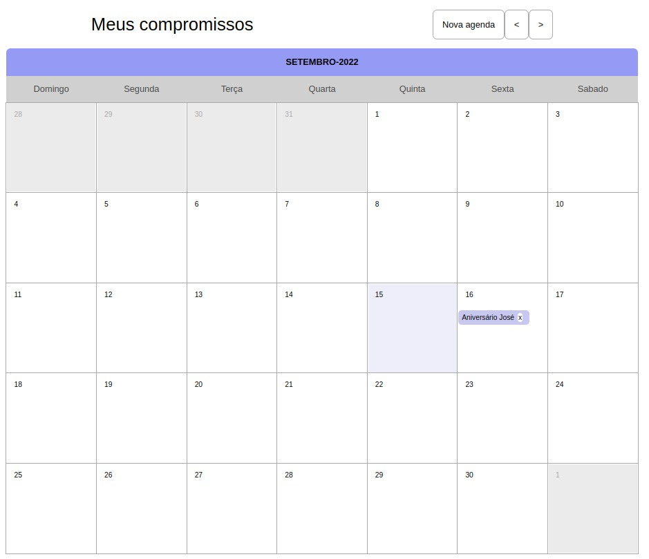
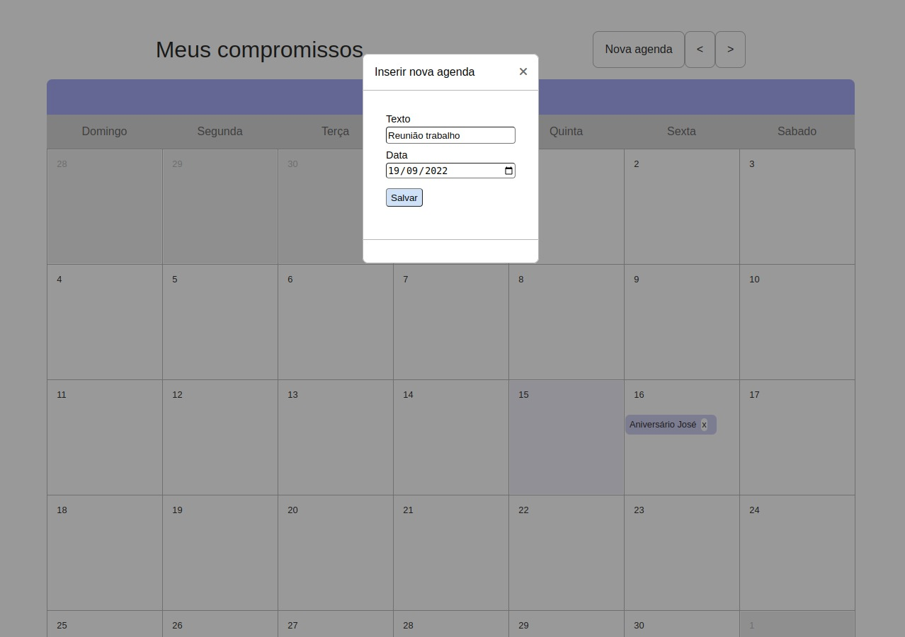
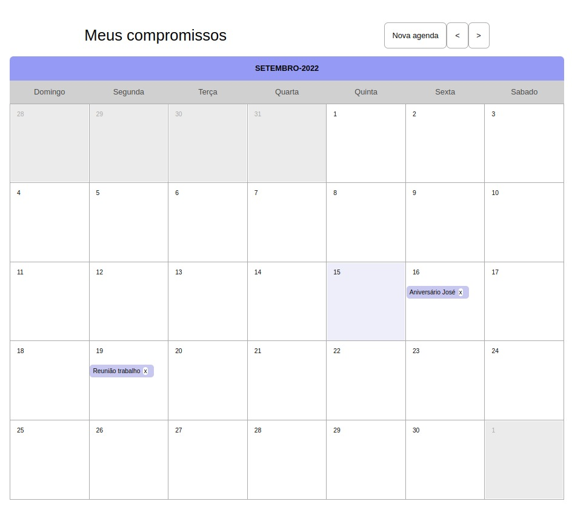

# My calendar
> It's a calendar with an API to see, add and delete your events

## Table of Contents
* [Technologies Used](#technologies-used)
* [Screenshots](#screenshots)
* [Setup](#setup)

## Technologies Used
- Javascript
- nodeJS
- HTML
- CSS

## Screenshots

## Setup
You have to run "npm start" to initialize the calendar, and on another terminal, run "npm run api", so the API can start.
Access "http://localhost:5000" to see the calendar.